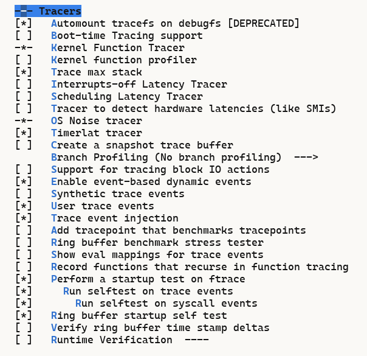

<p align="center">
  <a href="https://github.com/ChenMiaoi/GSoC-2025-Final-Report/blob/main/tests/ftrace-test/README.md">English</a> •
  <a href="https://github.com/ChenMiaoi/GSoC-2025-Final-Report/blob/main/tests/ftrace-test/README_zh.md">简体中文</a>
</p>

# Ftrace Selftest Test

[](https://github.com/ChenMiaoi/GSoC-2025-Final-Report/blob/main/tests/ftrace-test/README)
[](https://github.com/ChenMiaoi/GSoC-2025-Final-Report/blob/main/tests/ftrace-test/README_zh.md)

Here is the introduction to the usage of kselftest for ftrace regarding my porting of the OpenRISC architecture. Please prepare the following environment:

- QEMU OR1K
- or1k-none-linux-musl- toolchain
- A kernel source that has already applied my patches

The following is my local environment, for reference only:

``` bash
$ qemu-or1k --version
qemu-or1k version 10.0.50
Copyright (c) 2003-2025 Fabrice Bellard and the QEMU Project developers

$ or1k-none-linux-musl-gcc -v
Using built-in specs.
COLLECT_GCC=or1k-none-linux-musl-gcc
COLLECT_LTO_WRAPPER=/home/nya/work/openrisc/linux-on-or1ksim/or1k-none-linux-musl/bin/../libexec/gcc/or1k-none-linux-musl/15.1.0/lto-wrapper
Target: or1k-none-linux-musl
Thread model: posix
Supported LTO compression algorithms: zlib
gcc version 15.1.0 (GCC) 
```

If you haven’t prepared these environments yet, please refer to this section for environment configuration: [How To Check My Works](https://github.com/ChenMiaoi/GSoC-2025-Final-Report/blob/main/README.md#how-to-check-my-works).

Following the instructions above, you can find the corresponding toolchain at the following locations:

- `QEMU`: $HOME/work/openrisc/qemu/build/qemu-or1k
- `or1k-none-linux-musl-`: [or1k-none-linux-musl DownLoad URL](https://github.com/stffrdhrn/or1k-toolchain-build/releases/download/or1k-15.1.0-20250621/or1k-none-linux-musl-15.1.0-20250621.tar.xz)

Once the environment is prepared, you can proceed with testing:

``` bash
$ make -j12 LC_ALL=en_US.UTF-8 ARCH=openrisc CROSS_COMPILE=or1k-none-linux-musl- CONFIG_INITRAMFS_SOURCE= virt_defconfig

$ make -j12 LC_ALL=en_US.UTF-8 ARCH=openrisc CROSS_COMPILE=or1k-none-linux-musl- CONFIG_INITRAMFS_SOURCE= menuconfig
```

**​​Please note that in the current OpenRISC implementation, my ftrace implementation only covers the static ftrace portion and does not include dynamic ftrace. Additionally, after analysis, the current static ftrace graph has issues**.​​ Therefore, you need to enable the following options:



- CONFIG_FTRACE=y
- CONFIG_FUNCTION_TRACER=y
- CONFIG_RING_BUFFER_BENCHMARK=y
- CONFIG_FTRACE_SELFTEST=y
- CONFIG_FTRACE_STARTUP_TEST=y
- CONFIG_EVENT_TRACE_STARTUP_TEST=y
- CONFIG_EVENT_TRACE_TEST_SYSCALLS=y
- CONFIG_TIMER_TRACER=y
- CONFIG_OSNOISE_TRACER=y
- CONFIG_TRACER_MAX_TRACE=y
- CONFIG_TRACE_EVENT_INJECT=y

After selecting the corresponding configurations as shown in the image above, please refer to the sections [How To Check My Works](https://github.com/ChenMiaoi/GSoC-2025-Final-Report/blob/main/README.md#how-to-check-my-works) and [How To Test](https://github.com/ChenMiaoi/GSoC-2025-Final-Report/blob/main/more-details/working/how_to_test.md) to compile and run the QEMU virtual machine:

During the startup process, you will see the boot-phase kselftest that has already been loaded.

``` bash
[    0.830000] Running ring buffer tests...
[   11.370000] finished
[   11.370000] CPU 0:
[   11.370000]               events:    1037
[   11.370000]        dropped bytes:    0
[   11.370000]        alloced bytes:    80304
[   11.370000]        written bytes:    78664
[   11.370000]        biggest event:    50
[   11.370000]       smallest event:    0
[   11.370000]          read events:   1037
[   11.370000]          lost events:   0
[   11.370000]         total events:   1037
[   11.370000]   recorded len bytes:   80304
[   11.370000]  recorded size bytes:   78664
[   11.370000] Ring buffer PASSED!
[   11.370000] Running tests on trace events:
[   11.370000] Testing event initcall_finish: OK
[   11.400000] Testing event initcall_start: OK
[   11.420000] Testing event initcall_level: OK
[   11.440000] Testing event task_prctl_unknown: OK
[   11.460000] Testing event task_rename: OK
[   11.480000] Testing event task_newtask: OK
[   11.500000] Testing event cpuhp_exit: OK
[   11.520000] Testing event cpuhp_multi_enter: OK
[   11.540000] Testing event cpuhp_enter: OK
[   11.560000] Testing event tasklet_exit: OK
......
[  128.370000] Testing all events: OK
[  130.160000] Testing ftrace filter: OK
```

After the startup is complete, you need to follow the steps below to perform additional tests to verify feasibility:

``` bash
$ mount -t tracefs nodev /sys/kernel/tracing/
$ cd /sys/kernel/tracing
$ cat current_tracer
nop
$ echo function > current_tracer
$ echo 1 > tracing_on
$ usleep 1
$ echo 0 > tracing_on
```

> **​​Note: After performing the above operations, you may notice that the virtual machine becomes very sluggish or even experiences Out-of-Memory (OOM) issues. This is normal behavior.​**​

Then, check the records in the tracer:

``` bash
$ cat tracer
# tracer: function
#
# entries-in-buffer/entries-written: 72168/11436518   #P:1
#
#                                _-----=> irqs-off/BH-disabled
#                               / _----=> need-resched
#                              | / _---=> hardirq/softirq
#                              || / _--=> preempt-depth
#                              ||| / _-=> migrate-disable
#                              |||| /     delay
#           TASK-PID     CPU#  |||||  TIMESTAMP  FUNCTION
#              | |         |   |||||     |         |
             cat-2212    [000] d.h..   369.060000: arch_local_irq_restore <-generic_atomic64_read
CPU:0 [LOST EVENTS]
             cat-2212    [000] d....   369.370000: arch_local_save_flags <-generic_atomic64_read
             cat-2212    [000] d....   369.370000: arch_local_irq_restore <-generic_atomic64_read
             cat-2212    [000] d....   369.370000: arch_local_irq_restore <-generic_atomic64_read
             cat-2212    [000] d....   369.370000: arch_local_save_flags <-generic_atomic64_read
             cat-2212    [000] d....   369.370000: arch_local_irq_restore <-generic_atomic64_read
             cat-2212    [000] d....   369.370000: arch_local_irq_restore <-generic_atomic64_read
             cat-2212    [000] d....   369.370000: arch_local_save_flags <-generic_atomic64_set
```
