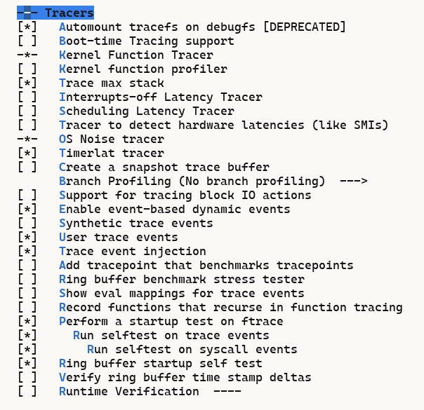

<p align="center">
  <a href="https://github.com/ChenMiaoi/GSoC-2025-Final-Report/blob/main/tests/ftrace-test/README.md">English</a> •
  <a href="https://github.com/ChenMiaoi/GSoC-2025-Final-Report/blob/main/tests/ftrace-test/README_zh.md">简体中文</a>
</p>

# Ftrace Selftest Test

[](https://github.com/ChenMiaoi/GSoC-2025-Final-Report/blob/main/tests/ftrace-test/README)
[](https://github.com/ChenMiaoi/GSoC-2025-Final-Report/blob/main/tests/ftrace-test/README_zh.md)

这里介绍针对我对于OpenRISC架构移植的ftrace的kselftest的使用方式。请您准备好如下环境：

- QEMU OR1K
- or1k-none-linux-musl- toolchain
- 已经应用了我的patches的内核

如下是我的本地环境，仅供参考：

``` bash
$ qemu-or1k --version
qemu-or1k version 10.0.50
Copyright (c) 2003-2025 Fabrice Bellard and the QEMU Project developers

$ or1k-none-linux-musl-gcc -v
Using built-in specs.
COLLECT_GCC=or1k-none-linux-musl-gcc
COLLECT_LTO_WRAPPER=/home/nya/work/openrisc/linux-on-or1ksim/or1k-none-linux-musl/bin/../libexec/gcc/or1k-none-linux-musl/15.1.0/lto-wrapper
Target: or1k-none-linux-musl
Thread model: posix
Supported LTO compression algorithms: zlib
gcc version 15.1.0 (GCC) 
```

如果您目前还没有准备好这些环境，请参考这一节进行环境配置[How To Check My Works](https://github.com/ChenMiaoi/GSoC-2025-Final-Report/blob/main/README.md#how-to-check-my-works)。

按照上述方式，您能够在如下的位置找到对应的工具链：

- `QEMU`: $HOME/work/openrisc/qemu/build/qemu-or1k
- `or1k-none-linux-musl-`: [or1k-none-linux-musl DownLoad URL](https://github.com/stffrdhrn/or1k-toolchain-build/releases/download/or1k-15.1.0-20250621/or1k-none-linux-musl-15.1.0-20250621.tar.xz)

准备好环境后，就可以开始进行测试了：

``` bash
$ make -j12 LC_ALL=en_US.UTF-8 ARCH=openrisc CROSS_COMPILE=or1k-none-linux-musl- CONFIG_INITRAMFS_SOURCE= virt_defconfig

$ make -j12 LC_ALL=en_US.UTF-8 ARCH=openrisc CROSS_COMPILE=or1k-none-linux-musl- CONFIG_INITRAMFS_SOURCE= menuconfig
```

**这里需要注意，在目前的OpenRISC中，我所实现的ftrace仅涉及static ftrace部分，并没有实现dynamic ftrace，同时，经过分析，当前的static ftrace graph存在问题**。因此您需要打开如下选项：



- CONFIG_FTRACE=y
- CONFIG_FUNCTION_TRACER=y
- CONFIG_RING_BUFFER_BENCHMARK=y
- CONFIG_FTRACE_SELFTEST=y
- CONFIG_FTRACE_STARTUP_TEST=y
- CONFIG_EVENT_TRACE_STARTUP_TEST=y
- CONFIG_EVENT_TRACE_TEST_SYSCALLS=y
- CONFIG_TIMER_TRACER=y
- CONFIG_OSNOISE_TRACER=y
- CONFIG_TRACER_MAX_TRACE=y
- CONFIG_TRACE_EVENT_INJECT=y

当您如上图一样勾选好相应的配置后，请您参考[How To Check My Works](https://github.com/ChenMiaoi/GSoC-2025-Final-Report/blob/main/README.md#how-to-check-my-works)以及[How To Test](https://github.com/ChenMiaoi/GSoC-2025-Final-Report/blob/main/more-details/working/how_to_test.md)章节，编译并运行QEMU虚拟机：

在启动过程中，你可以看见已经被载入的boot阶段的kselftest：

``` bash
[    0.830000] Running ring buffer tests...
[   11.370000] finished
[   11.370000] CPU 0:
[   11.370000]               events:    1037
[   11.370000]        dropped bytes:    0
[   11.370000]        alloced bytes:    80304
[   11.370000]        written bytes:    78664
[   11.370000]        biggest event:    50
[   11.370000]       smallest event:    0
[   11.370000]          read events:   1037
[   11.370000]          lost events:   0
[   11.370000]         total events:   1037
[   11.370000]   recorded len bytes:   80304
[   11.370000]  recorded size bytes:   78664
[   11.370000] Ring buffer PASSED!
[   11.370000] Running tests on trace events:
[   11.370000] Testing event initcall_finish: OK
[   11.400000] Testing event initcall_start: OK
[   11.420000] Testing event initcall_level: OK
[   11.440000] Testing event task_prctl_unknown: OK
[   11.460000] Testing event task_rename: OK
[   11.480000] Testing event task_newtask: OK
[   11.500000] Testing event cpuhp_exit: OK
[   11.520000] Testing event cpuhp_multi_enter: OK
[   11.540000] Testing event cpuhp_enter: OK
[   11.560000] Testing event tasklet_exit: OK
......
[  128.370000] Testing all events: OK
[  130.160000] Testing ftrace filter: OK
```

启动完成后，你需要按照以下步骤进行额外测试是否可行：

``` bash
$ mount -t tracefs nodev /sys/kernel/tracing/
$ cd /sys/kernel/tracing
$ cat current_tracer
nop
$ echo function > current_tracer
$ echo 1 > tracing_on
$ usleep 1
$ echo 0 > tracing_on
```

> **注意：进行上述操作后，您会发现虚拟机设备十分卡顿，甚至出现OOM现象，这是正常情况**。

然后查看`tracer`中的记录：

``` bash
$ cat tracer
# tracer: function
#
# entries-in-buffer/entries-written: 72168/11436518   #P:1
#
#                                _-----=> irqs-off/BH-disabled
#                               / _----=> need-resched
#                              | / _---=> hardirq/softirq
#                              || / _--=> preempt-depth
#                              ||| / _-=> migrate-disable
#                              |||| /     delay
#           TASK-PID     CPU#  |||||  TIMESTAMP  FUNCTION
#              | |         |   |||||     |         |
             cat-2212    [000] d.h..   369.060000: arch_local_irq_restore <-generic_atomic64_read
CPU:0 [LOST EVENTS]
             cat-2212    [000] d....   369.370000: arch_local_save_flags <-generic_atomic64_read
             cat-2212    [000] d....   369.370000: arch_local_irq_restore <-generic_atomic64_read
             cat-2212    [000] d....   369.370000: arch_local_irq_restore <-generic_atomic64_read
             cat-2212    [000] d....   369.370000: arch_local_save_flags <-generic_atomic64_read
             cat-2212    [000] d....   369.370000: arch_local_irq_restore <-generic_atomic64_read
             cat-2212    [000] d....   369.370000: arch_local_irq_restore <-generic_atomic64_read
             cat-2212    [000] d....   369.370000: arch_local_save_flags <-generic_atomic64_set
```
